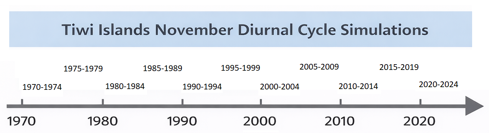

# Tiwi Island thunderstorm simulations

Greetings fellow ACCESS-rAM3er! This github is for work related to ACCESS-rAM3 Tiwi Island thunderstorm simulations run under modified ERA5 initial and boundary conditions.

# Overview of the simulations
The simulations are 12 hours long from 0000 UTC to 1200 UTC. In Tiwi Islands local time (UTC + 0930) this is from 0930 to 2130.

We modify the ERA5 initial and boundary conditions creating new ERA5 files that have identical formatting and place them in a new "fake" ERA5 directory tree. 
We copy over some of the ACCESS-rAM3 python scripts and redirect where they access the ERA5 files so that they read in our new files. Some other modifications are needed and will be documented here.
So long as this is done correctly and the date and time of your ERA5 modified files match those you have set in ACCESS-rAM3, this should work however issues and potential instabilities due to ingesting modified data are possible.

Some other updates, there is now an additional set of simulations that are based on November 5 year climatological diurnal cycles going back to 1970 in:  
/g/data/gx60/experiments/2025-11-19_Tiwi_12h_1970-1974
These are initialized from 5 year period climatologies of all the 3D variables so including the winds.

# Domain setup

# Key links, where to get help and information

If you are new to ACCESS-rAM3 and planning to use it, then the first thing to do is to run through the standard Lismore flood tutorial case.

Tiwi Islands ACCESS 
This repository contains information about the Tiwi Islands thunderstorm configuration. It is being maintained by Chris Chambers (cchambers@unimelb.edu.au)

#Key links

ACCESS-rAM3 getting started:
https://docs.access-hive.org.au/models/run-a-model/run-access-ram/

UM Chemistry page for details on adding variables using the rose GUI: https://www.ukca.ac.uk/wiki/index.php/UKCA_Chemistry_and_Aerosol_vn11.8_Tutorial_10

Mat Lipson et al. github on the Sydney 1 km domain, it is this setup that was the base domain setup that we have used: 
https://github.com/21centuryweather/RNS_Sydney_1km

# Where is the data?

The output from the simulations has approved storage on gdata ACCESS-NRI project gx60 so you will have to request membership for that project.
There are two sets of 11 simulations that use 5 year climatological November conditions 1970-1974  ..... 2020 to 2024 as the initial, and boundary conditions.
The two sets differ in the 3D climatological data only.

The first set uses 3D 5-year climatological data for all four of the 3D variables; u, v, q, t. This set is stored in:

/g/data/gx60/experiments/2025-11-19_Tiwi_12h_1970-1974/19851101T0000Z

IMPORTANT! The 2025-11-19_Tiwi_12h_1970-1974 part of the directory name does not need to be changed for different periods, it is just the name set when the storage was approved.

The second set uses 5-year climatological data for q and t, while u and v are set to zero. This set is stored in:

/g/data/gx60/experiments/2025-06-11_tiwi/20001101T0000Z

The full path for the innermost 1 km resolution domain, for example for the 1970 to 1974 November climatology runs is in:

/g/data/gx60/experiments/2025-06-11_tiwi/19701101T0000Z/Tiwi_12h_1970-1974_windzero/Tiwi_1/RAL3P2/um/

Within this we have the data files in netcdf format:

umnsaa_sfc000.nc   surface variables

umnsaa_pa000.nc    3D variables on theta model levels

umnsaa_rh000.nc    3D variables on rh model levels 

# What are the available variables?
Below are listed all the variables available in the data. The data is divided into 3 netcdf files for each simulations. The filename is above each list.
The variable names are unfortunately in a form e.g. `STASH_m01s00i012`. These names refer to Met Office stash codes.

umnsaa_pa000.nc

| Variable           | CF standard_name                                | Description                                           |
| ------------------ | ----------------------------------------------- | ----------------------------------------------------- |
| `STASH_m01s00i012` | `mass_fraction_of_cloud_ice_in_air`             | Cloud ice mass fraction after timestep (QCF)          |
| `STASH_m01s00i254` | `mass_fraction_of_cloud_liquid_water_in_air`    | Cloud liquid water mass fraction after timestep (QCL) |
| `STASH_m01s00i271` | *inferred:* `mass_fraction_of_cloud_ice_in_air` | Cloud ice (crystals) after timestep                   |
| `STASH_m01s00i272` | *inferred:* `mass_fraction_of_rainwater_in_air` | Rain water mixing ratio after timestep                |
| `STASH_m01s00i395` | *inferred:* `mass_fraction_of_graupel_in_air`   | Graupel mixing ratio after timestep                   |
| `STASH_m01s04i118` | *inferred:* `equivalent_reflectivity_factor`    | Total 3-D radar reflectivity (dBZ)                    |
| `STASH_m01s15i101` | `height_above_reference_ellipsoid`              | Height of theta model levels above sea level          |
| `STASH_m01s15i218` | `potential_vorticity_of_atmosphere_layer`       | Potential vorticity on model theta levels             |
| `STASH_m01s16i004` | `air_temperature`                               | Air temperature on theta levels                       |
| `STASH_m01s16i207` | *inferred:* `specific_humidity`                 | Total specific humidity (qT)                          |

umnsaa_rh000.nc

| Variable           | CF standard_name                   | Description                                |
| ------------------ | ---------------------------------- | ------------------------------------------ |
| `STASH_m01s15i102` | `height_above_reference_ellipsoid` | Height of rho model levels above sea level |
| `STASH_m01s30i001` | `x_wind`                           | Zonal (x-component) wind on rho grid       |
| `STASH_m01s30i002` | `y_wind`                           | Meridional (y-component) wind on rho grid  |
| `STASH_m01s30i003` | `upward_air_velocity`              | Vertical wind component on rho grid        |

umnsaa_sfc000.nc

| Variable           | CF standard_name                                     | Description                             |
| ------------------ | ---------------------------------------------------- | --------------------------------------- |
| `STASH_m01s03i225` | `x_wind`                                             | 10 m zonal wind component (B grid)      |
| `STASH_m01s03i226` | `y_wind`                                             | 10 m meridional wind component (B grid) |
| `STASH_m01s03i234` | `surface_upward_latent_heat_flux`                    | Surface latent heat flux                |
| `STASH_m01s03i236` | `air_temperature`                                    | Air temperature at 1.5 m                |
| `STASH_m01s03i237` | `specific_humidity`                                  | Specific humidity at 1.5 m              |
| `STASH_m01s03i250` | `dew_point_temperature`                              | Dewpoint temperature at 1.5 m           |
| `STASH_m01s04i111` | *inferred:* `maximum_equivalent_reflectivity_factor` | Maximum radar reflectivity in column    |
| `STASH_m01s04i112` | *inferred:* `equivalent_reflectivity_factor`         | Radar reflectivity at 1 km AGL          |
| `STASH_m01s04i201` | `stratiform_rainfall_amount`                         | Large-scale (stratiform) rain amount    |
| `STASH_m01s04i203` | `stratiform_rainfall_flux`                           | Large-scale (stratiform) rainfall rate  |
| `STASH_m01s16i222` | `air_pressure_at_sea_level`                          | Mean sea-level pressure                 |
| `STASH_m01s20i114` | *inferred:* `convective_available_potential_energy`  | Surface-based CAPE (SBCAPE)             |
| `STASH_m01s21i104` | *inferred:* `number_of_lightning_flashes`            | Number of lightning flashes             |

# Setup ACCESS-rAM3 to read your modified ERA5 files

As of December 2025 these are just rough notes on this process and the directories are those that I used. 
This method was used in the middle of 2025 using the first full release of ACCESS-rAM3 so there may be potential changes that have occured since - adapt accordingly ;) 
Thanks to Paul Gregory for helping out and Chermelle Engel for her python scripts and advice.

What we are doing here is creating copies of some ACCESS-rAM3 scripts so that we can modify them to change the directory where they access the ERA5 directories.

* Create a new directory that will contain the nci_era5grib_parralel python scripts

mkdir era5grib_parallel
*	So this is now going to be my nci_era5grib_parralel directory:
/home/563/cc6171/era5grib_parallel
*	It is OK to keep in my home directory as it is just scripts so not large.
*	Now copy Chermelle’s nci_era5grib_parralel python scripts to this directory.

cd era5grib_parallel

cp /g/data/vk83/apps/conda/access-ram/2025.03.0/lib/python3.11/site-packages/era5grib_parallel/cdo_era5grib.py ./

cp /g/data/vk83/apps/conda/access-ram/2025.03.0/lib/python3.11/site-packages/era5grib_parallel/nci_era5grib_parallel.py ./
 
*	Now change the ERA5 directory so that it now uses your modified "fake" ERA5 directories.

vi cdo_era5grib.py

ERADIR = "/scratch/gb02/cc6171/era5"
*	Creating your own fake ERA5 directories.
*	make sure you keep the same subdirectory structure as used for the original ERA5 data on NCI. This is because the python scripts access and define these sub directories. These could be changed in the scripts at a later date but for the moment, and probably forever I’m keeping as is.

* and then change the command in the app/nci_era5grib_parallel/rose-app.conf to point to the location of your modified python script.

* Next step is to create your fake ERA5 directories, change to your fake ERA5 directories.

cd /g/data/gb02/cc6171/
*	make your new base era5 directory - should move this off scratch.
*	there are a lot of era5 directories to be created, it is better to write a script that creates the directories - chatGPT can help, I will look for the script I used.

mkdir era5

cd era5
*	ERA5 directories, create these directory structures for all the variables both 3D and 2D used as input to ACCESS-rAM3:

era5/single-levels/reanalysis/......

era5/pressure-levels/reanalysis/.....

* here is a list of all the ERA5 variables that ACCESS-rAM3 uses as input:

        "skt, single, 235",
        "sp, single, 134",
        "ci, single, 31",
        "sst, single, 34",
        "sd, single, 141",
        "stl1, single, 139",
        "stl2, single, 170",
        "stl3, single, 183",
        "stl4, single, 236",
        "swvl1, single, 39",
        "swvl2, single, 40",
        "swvl3, single, 41",
        "swvl4, single, 42",
        "u, pressure, 131",
        "v, pressure, 132",
        "t, pressure, 130",
        "q, pressure, 133",
        "lsm, single, 172",
        "z, single, 129"]

Once all this is done you can modify ERA5 data and place them in your new directories.

# Creating the ERA5 decadal mid November climatologies

see method_ERA5_climatology.md
Our updated method uses the ERA5 monthly averaged by hour data that is available on NCI.
Our earlier method focussed on a mid-November environment and involved taking out the 10 to 19 Nov ERA5 data over a large Australia covering region for a decade, for example 2010 to 2019 and then averaging across all these mid-November days (100 in total) to create a 24 hour climatology hourly 1 day dataset representative of the pre-monsoon in that decade.
see method_ERA5_climatology.md

# Early tests

12 December 2016 vs 12 Dec 2016 with zero wind applied to the initial and boundary conditions.

https://github.com/user-attachments/assets/5a4778a0-930a-4998-8eab-33fe083d127c

