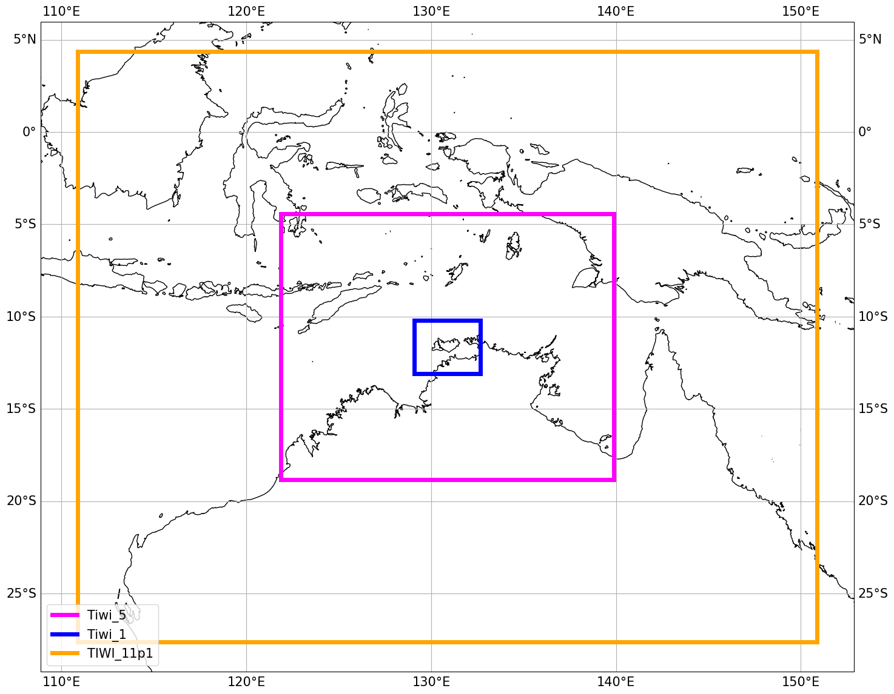
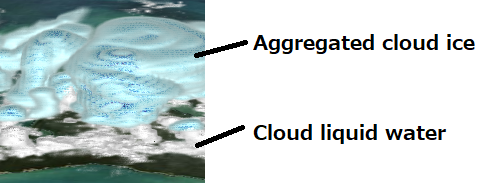

# Tiwi Island thunderstorm simulations
Tiwi Islands ACCESS 
This repository contains information about the Tiwi Islands thunderstorm configuration. It is being maintained by Chris Chambers (cchambers@unimelb.edu.au)

#Key links

ACCESS-rAM3 getting started:
https://docs.access-hive.org.au/models/run-a-model/run-access-ram/

UM Chemistry page for details on adding variables using the rose GUI: https://www.ukca.ac.uk/wiki/index.php/UKCA_Chemistry_and_Aerosol_vn11.8_Tutorial_10

Mat Lipson et al. github on the Sydney 1 km domain, it is this setup that was the base domain setup that I have used: 
https://github.com/21centuryweather/RNS_Sydney_1km

# Domain setup

# Creating the ERA5 decadal mid November climatologies
see method_ERA5_climatology.md
The method involves taking out the 10 to 19 Nov ERA5 data over a large Australia covering region for a decade, for example 2010 to 2019 and then averaging across all these mid-November days (100 in total) to create a 24 hour climatology hourly 1 day dataset representative of the pre-monsoon in that decade.
see method_ERA5_climatology.md

# Early tests

12 December 2016 vs 12 Dec 2016 with zero wind applied to the initial and boundary conditions.

https://github.com/user-attachments/assets/5a4778a0-930a-4998-8eab-33fe083d127c

